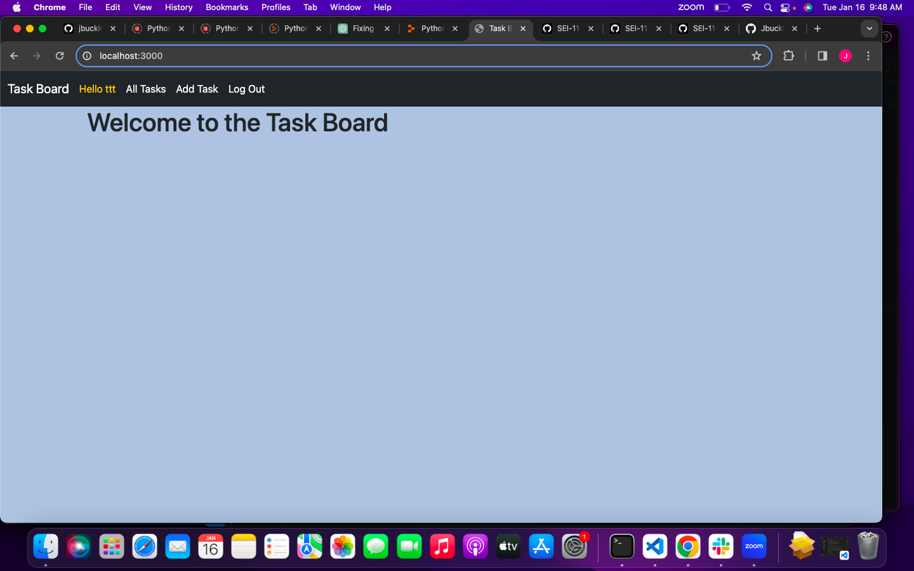
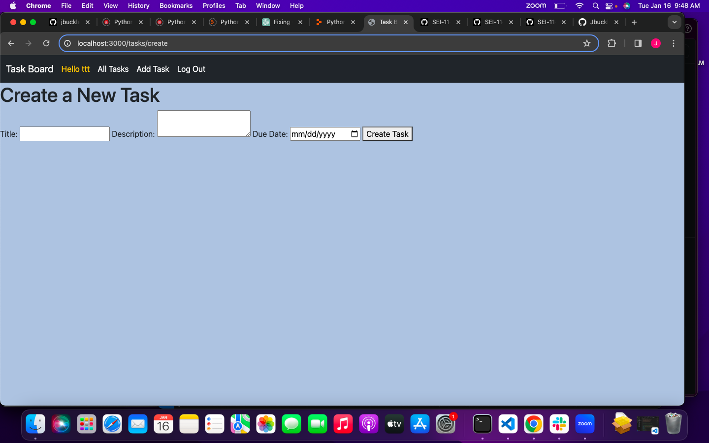
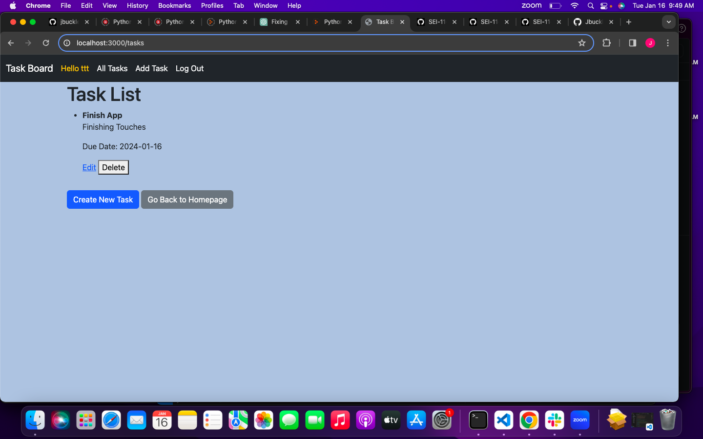
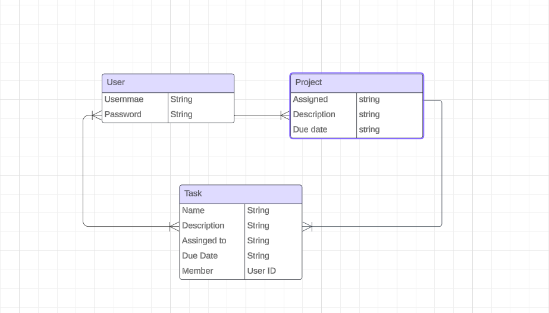

# Task Board App

A collaborative task management application that enables teams to efficiently organize, track, and complete tasks collaboratively. It allows users to create, assign, and manage tasks within a team environment.

User stories:
Ice Box:

-As a user, I want to be able to create a new task with a title, description, and due date.

-As a user, I want to be able to assign tasks to specific team members,

-As a user, I want to receive notifications for upcoming task deadlines,

Current/MVP:

-As a user, I want to be able to log in using OAuth authentication.

-As a user, I want to view a list of tasks assigned to me.

-As a user, I want to be able to delete tasks.

Completed:

-As a user, I want to be able to edit task details.

-As a team member, I want to see a history of task activities.

Wireframes:
Homepage:

Add a task page:

ERD:

